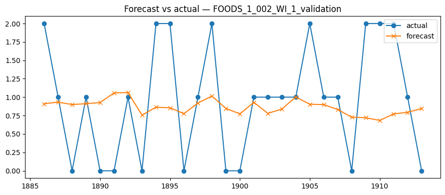
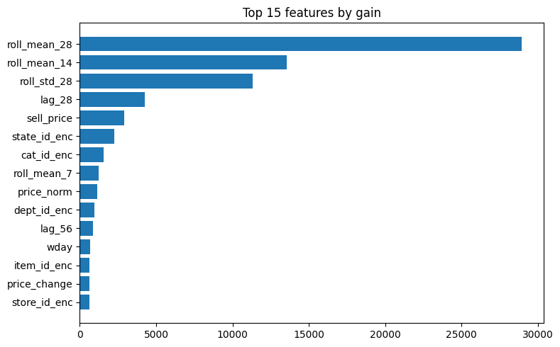

# Store Inventory Demand Analysis & Optimization

Forecasting product demand and optimizing store inventory using classical time-series
models and gradient boosting, with an SQL/Excel reporting layer for tracking sales,
stock, and stockout risk.

> **Status:** Self-project · **Goal:** reduce stockouts and lost sales through better
> demand forecasting and a data-driven reorder policy.

---

## Table of Contents
- [Problem](#problem)
- [Dataset](#dataset)
- [Tech Stack](#tech-stack)
- [Approach](#approach)
- [Results](#results)
- [Visuals](#visuals)
- [Repository Structure](#repository-structure)
- [How to Run](#how-to-run)
- [Key Takeaways](#key-takeaways)

---

## Problem
Retailers lose revenue from two directions: **stockouts** (demand they can't meet) and
**overstock** (capital and space tied up in slow-moving inventory). Both come down to one
hard question — *how much will sell, where, and when?* This project forecasts daily/weekly
demand per store and item, converts those forecasts into a reorder policy with safety
stock, and surfaces the results in a reporting layer a store manager could actually use.

## Dataset
Daily retail sales across multiple stores and items over five years.

- **Source:** [Store Item Demand Forecasting Challenge (Kaggle)](https://www.kaggle.com/competitions/demand-forecasting-kernels-only/data)
- *(Alternative used for inventory columns: [Retail Store Inventory Forecasting Dataset](https://www.kaggle.com/datasets/anirudhchauhan/retail-store-inventory-forecasting-dataset))*
- **Shape:** ~913,000 rows · columns: `date`, `store`, `item`, `sales`
- **Note:** the raw CSV is **not** committed to this repo (see [How to Run](#how-to-run)) — download it from the link above.

## Tech Stack
| Layer | Tools |
|---|---|
| Forecasting / ML | Python, statsmodels, pmdarima, XGBoost, scikit-learn |
| Data store / queries | SQL (SQLite) |
| Reporting | Excel (Power Query, conditional formatting) |
| Environment | Google Colab / Jupyter |

## Approach
1. **EDA & decomposition** — examined trend, weekly and yearly seasonality via
   seasonal decomposition; chose a **store–week aggregation** for the headline forecast,
   since item-level daily demand is too noisy for single-digit error.
2. **Validation** — **time-based** train/test split (last `<N>` weeks held out); no random
   splitting, to avoid look-ahead leakage.
3. **Models compared:**
   - **ARIMA / SARIMA** — orders selected via ADF stationarity test + `auto_arima`.
   - **Holt-Winters (Exponential Smoothing)** — additive trend + seasonality.
   - **VECM** — exploratory multivariate model for stores sharing a long-run demand trend
     (cointegration checked with the Johansen test).
   - **XGBoost** — engineered lag, rolling-mean, and calendar features as an ML baseline.
4. **Inventory optimization** — derived **reorder point = (avg demand × lead time) + safety
   stock**, where **safety stock = z × σ_demand × √(lead time)** at a `<95>%` service level.
5. **Lost-sales backtest** — simulated two reorder policies (naive vs. forecast-driven)
   over history and measured the change in unmet demand.

## Results
> Replace the placeholders below with **your actual** numbers from the notebook.

**Forecasting accuracy (store–week holdout):**

| Model | MAPE | RMSE | MAE |
|---|---|---|---|
| ARIMA / SARIMA | `<..>%` | `<..>` | `<..>` |
| Holt-Winters | `<..>%` | `<..>` | `<..>` |
| VECM (multivariate) | `<..>%` | `<..>` | `<..>` |
| XGBoost | `<..>%` | `<..>` | `<..>` |

- Best model: **`<model>`** at **MAPE `<..>`%** on the held-out store–week series.
- Inventory policy backtest: **`<..>`% reduction in simulated lost sales** vs. the naive
  baseline *(backtested on historical data, not a live A/B result)*.

## Visuals

**Forecast vs. actual** — model predictions against held-out demand:



**Feature importance** — top drivers of demand from the XGBoost model:



> ℹ️ These point to `forecast.png` and `features.png` in the repo root. If your files use a
> different extension (e.g. `.jpg`) or sit in a folder, update the paths to match exactly —
> GitHub image links are case-sensitive.

## Repository Structure
```
.
├── README.md
├── demand_forecasting.ipynb     # main notebook: EDA → models → backtest
├── forecast.png                 # forecast vs. actual plot
├── features.png                 # XGBoost feature importance
└── sql/
    └── inventory_queries.sql    # reorder point + low-stock view
```

## How to Run
1. Clone the repo:
   ```bash
   git clone https://github.com/<your-username>/<your-repo>.git
   ```
2. Download `train.csv` from the [Kaggle dataset](https://www.kaggle.com/competitions/demand-forecasting-kernels-only/data) and place it in a `data/` folder.
3. Open `demand_forecasting.ipynb` in Google Colab or Jupyter and run top to bottom.

Dependencies:
```bash
pip install pandas numpy matplotlib statsmodels pmdarima xgboost scikit-learn
```

## Key Takeaways
- Aggregation level is a deliberate accuracy trade-off — store–week is forecastable to
  single-digit MAPE; item–day is not, and pretending otherwise is a red flag.
- Time-series validation must respect time order; random splits leak the future.
- A good forecast is only useful once it drives a **decision** — here, the reorder point
  and safety stock — and the value is proven by **backtesting**, not assertion.

---
*Self-project. Synthetic/retail demand data used for learning purposes.*
